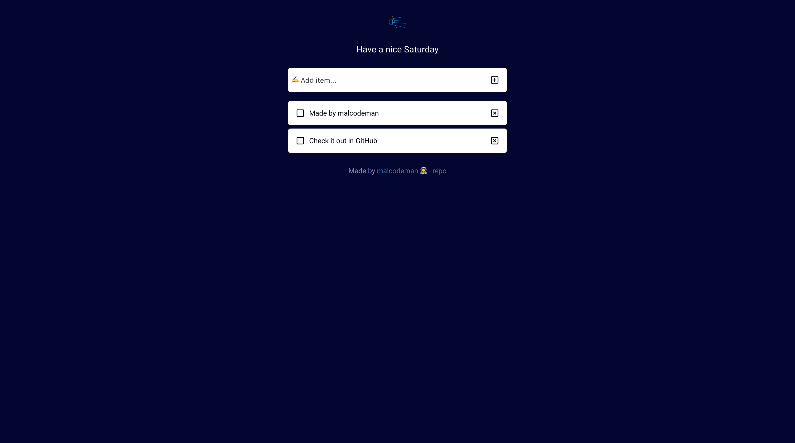

# [Reminders](http://reminders.surge.sh)

[](https://github.com/prettier/prettier)
[](https://github.com/malcodeman/reminders/blob/master/LICENSE)

React To-Do App with React Hooks.



## Usage

```
yarn install
yarn start
```

## Documentation

If you wish to deploy to [surge.sh](https://surge.sh) just edit `domain` variable in package.json to your liking and run `yarn deploy` command.

```
"domain": "reminders.surge.sh"
```

## Credits

- [Chris Sevilleja](https://github.com/sevilayha) for his excellent react hooks example [React To-Do with Hooks](https://codesandbox.io/s/oj3qm2zq06)
- [Quentin Colus](https://twitter.com/Quentin_cls) for making [Todost](http://todost.quentincolus.com)
- [Dale Humphries](https://twitter.com/dalehumphries) for making [space icon set freebie](https://tympanus.net/codrops/2016/03/18/freebie-astronomy-space-icons)
- [Roboto font](https://fonts.google.com/specimen/Roboto)

## License

This project is licensed under the MIT License - see the [LICENSE](LICENSE) file for details.
